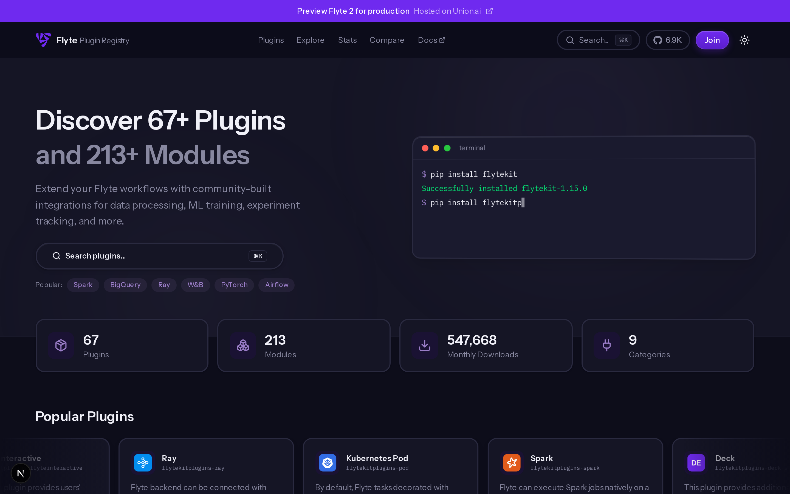
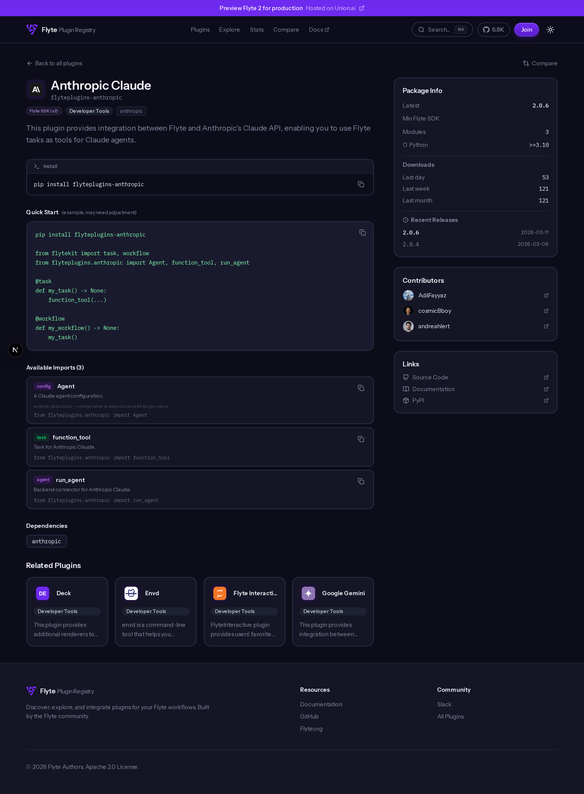
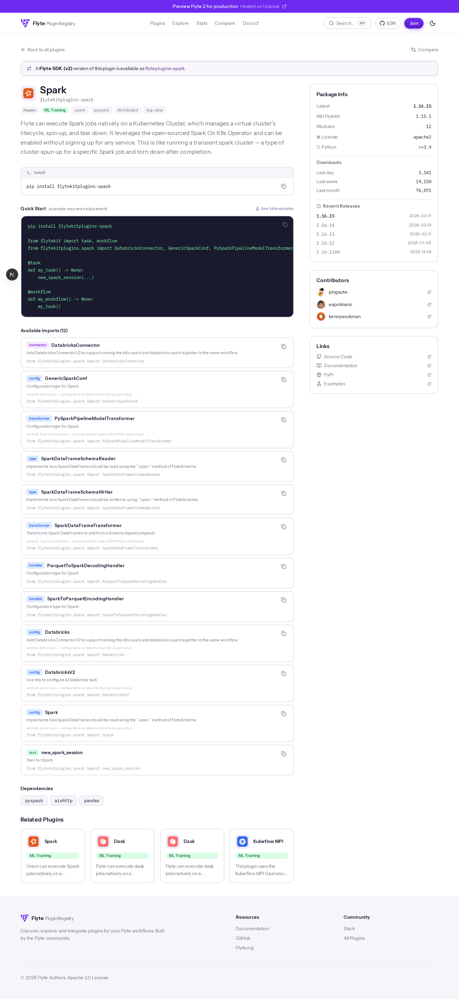
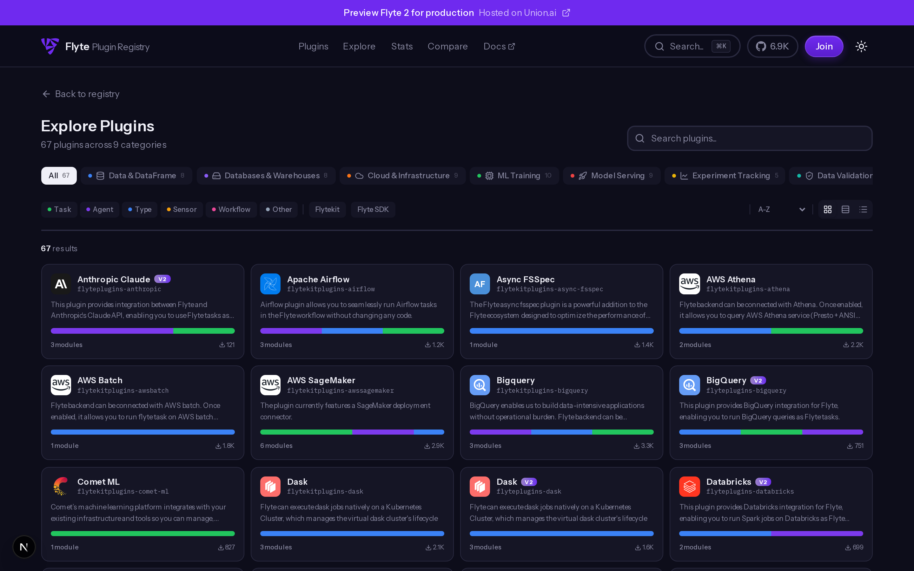
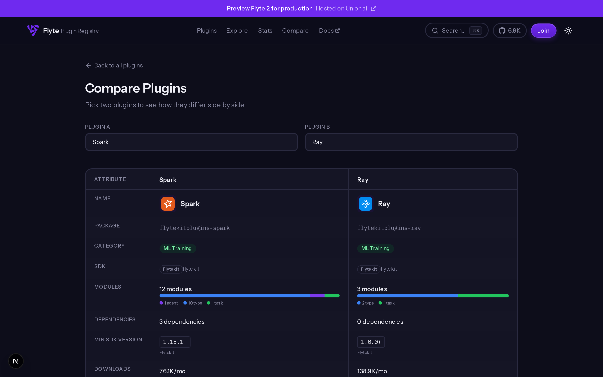
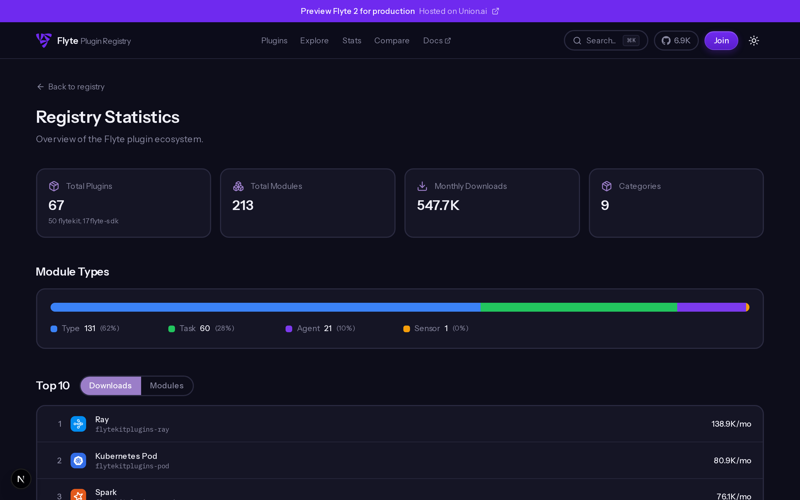
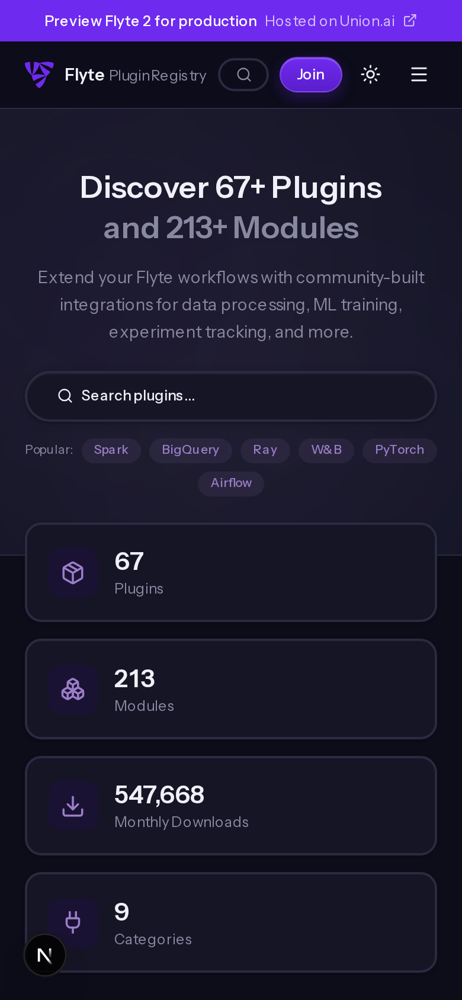

<p align="center">
  &nbsp;
  &nbsp;
  &nbsp;
  &nbsp;
  &nbsp;
  &nbsp;
  &nbsp;
  &nbsp;
  &nbsp;
  
</p>

<h1 align="center">Flyte Plugin Registry</h1>

<p align="center">
  <strong>The official browsable catalog for every plugin in the Flyte ecosystem.</strong><br/>
  <sub>67 plugins &middot; 213 modules &middot; Live PyPI stats &middot; Auto-generated icons &middot; Contributor data</sub>
</p>

<p align="center">
  <a href="https://andreahlert.github.io/flyte-plugin-registry/"></a>
</p>

<p align="center">
  <a href="https://github.com/flyteorg/flyte"></a>&nbsp;
  &nbsp;
  &nbsp;
  &nbsp;
  
</p>

---

<p align="center">
  
</p>

## Overview

The Flyte Plugin Registry provides a unified view of every plugin across the **flytekit** and **flyte-sdk** ecosystems. All data is scraped at build time from GitHub and PyPI, producing a fully static site that requires no backend.

Each plugin page includes:
- **Module inventory** with type classification (task, type transformer, agent, sensor) and base class hierarchy
- **Quick Start snippet** auto-generated from real import paths
- **Download metrics** fetched from PyPI (daily, weekly, monthly)
- **Version compatibility** showing minimum SDK version
- **Contributors** with GitHub avatars (original author always highlighted)
- **Direct links** to source code, PyPI page, and documentation

## Screenshots

<table>
  <tr>
    <td width="50%">
      <strong>Plugin Detail (Dark)</strong><br/>
      
    </td>
    <td width="50%">
      <strong>Plugin Detail (Light)</strong><br/>
      
    </td>
  </tr>
  <tr>
    <td width="50%">
      <strong>Explore</strong><br/>
      
    </td>
    <td width="50%">
      <strong>Compare</strong><br/>
      
    </td>
  </tr>
  <tr>
    <td width="50%">
      <strong>Stats</strong><br/>
      
    </td>
    <td width="50%">
      <strong>Mobile</strong><br/>
      <p align="center"></p>
    </td>
  </tr>
</table>

## Pages

| Route | Description |
|:------|:------------|
| `/` | Homepage with category grid, popular plugins, animated icon cloud, and ecosystem stats |
| `/plugins/[slug]` | Full plugin detail: modules, quick start, downloads, releases, contributors |
| `/explore` | Filterable grid with module type distribution bars and category/tag filtering |
| `/compare` | Side-by-side comparison table for any two plugins |
| `/stats` | Ecosystem rankings by downloads and module count |
| `/category/[slug]` | Category-filtered plugin listing (9 categories) |

## Data Pipeline

The build process runs three scripts sequentially before `next build`, producing all the data the static site needs:

```
generate-plugin-data.mjs    fetch-pypi-stats.mjs    generate-icons.mjs    next build
        │                          │                        │                  │
        ▼                          ▼                        ▼                  ▼
   plugins.json              pypi-stats.json         public/icons/       Static HTML
   (67 plugins,              (weekly downloads       (67 SVG icons)      (83 pages)
    213 modules,              for each package)
    contributors)
```

**Step 1: Plugin Data** (`generate-plugin-data.mjs`)
Scans `flyteorg/flytekit` and `flyteorg/flyte-sdk` on GitHub for plugin directories. For each plugin, it extracts module exports from `__init__.py`, fetches docstrings and Python base classes from source files, and resolves the top 3 contributors via `git log` (always including the original author).

**Step 2: Download Stats** (`fetch-pypi-stats.mjs`)
Queries the PyPI Stats API for daily, weekly, and monthly download counts of every plugin package.

**Step 3: Icon Generation** (`generate-icons.mjs`)
Produces an SVG icon per plugin using a three-tier fallback strategy:
1. Brand icon from the `simple-icons` package (39 plugins)
2. GitHub organization avatar (24 plugins)
3. Auto-generated initials with brand color (4 plugins)

New plugins are auto-discovered without manual mapping.

## Architecture

```
registry/
├── scripts/
│   ├── generate-plugin-data.mjs   # GitHub scraper: plugins, modules, base classes, contributors
│   ├── fetch-pypi-stats.mjs       # PyPI download stats
│   └── generate-icons.mjs         # SVG icon generation with auto-discovery
├── src/
│   ├── app/                       # Next.js App Router (6 page routes)
│   ├── components/
│   │   ├── home/                  # Hero, Categories, PopularPlugins, ContributeSection
│   │   ├── plugins/               # PluginCard, PluginDetailClient, ModuleList, RelatedPlugins
│   │   ├── compare/               # ComparePageClient
│   │   ├── explore/               # ExplorePageClient
│   │   ├── stats/                 # StatsPageClient
│   │   ├── layout/                # Header, Footer, SearchModal
│   │   └── ui/                    # ThemeToggle, IconCloud, Marquee, AnimatedTerminal
│   ├── data/
│   │   ├── plugins.json           # Generated: 67 plugins with modules and metadata
│   │   └── pypi-stats.json        # Generated: download counts
│   ├── hooks/                     # usePyPIMetadata, useGitHubReadme
│   └── lib/
│       ├── constants.ts           # Site config, module type colors, categories
│       ├── types.ts               # Plugin, PluginModule, StatsRecord interfaces
│       └── utils.ts               # formatDownloads, formatNumber
├── public/icons/plugins/          # 67 auto-generated SVG icons
└── .github/workflows/             # GitHub Pages deployment + scheduled data updates
```

## Getting Started

```bash
# Install
npm install

# Full build (scrape data + generate icons + static export)
npm run build

# Development
npm run dev

# Individual data scripts
npm run generate        # Re-scrape plugin data from GitHub
npm run fetch-stats     # Refresh PyPI stats
npm run generate-icons  # Regenerate icons
```

The dev server runs at [http://localhost:3000](http://localhost:3000). Build scripts require network access to the GitHub and PyPI APIs.

## Tech Stack

| Layer | Technology |
|:------|:-----------|
| Framework | [Next.js 16](https://nextjs.org/) with App Router and Turbopack |
| UI | [React 19](https://react.dev/) with View Transitions API for theme switching |
| Styling | [Tailwind CSS 4](https://tailwindcss.com/) with CSS custom properties |
| Animation | [Motion](https://motion.dev/) (Framer Motion) |
| Search | [Fuse.js](https://www.fusejs.io/) for client-side fuzzy matching |
| Icons | [simple-icons](https://simpleicons.org/) for brand SVGs |
| Deployment | Static export on GitHub Pages (no server required) |

## Contributing

This project is part of the [Flyte](https://github.com/flyteorg/flyte) ecosystem.

To **add a new plugin**, publish it as a flytekit or flyte-sdk plugin following the [Flyte contributing guide](https://www.union.ai/docs/v1/flyte/community/contributing-code/). The registry discovers new plugins automatically on the next build.

To **improve the registry itself**, fork this repo and open a PR. Please run `npm run lint` and `npm run build` before submitting.

## License

Apache 2.0, same as [Flyte](https://github.com/flyteorg/flyte/blob/master/LICENSE).
